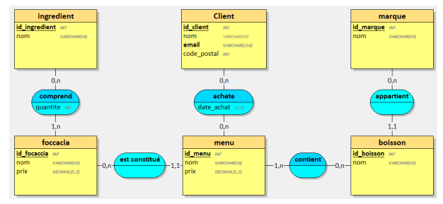
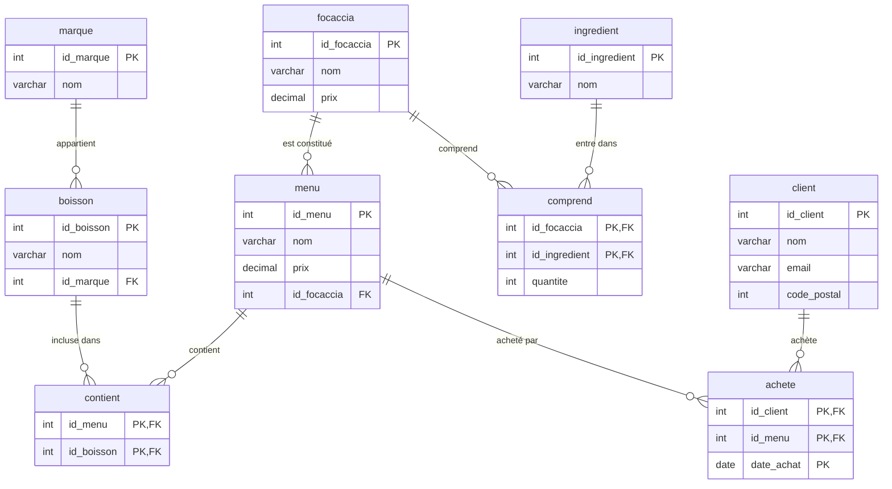

# Modélisation : base de données « Tifosi »

## 1. MCD fourni par le client

Le propriétaire du restaurant a fourni le modèle conceptuel de données (MCD)
suivant, qui sert de référence à toute la conception :




**Entités**

| Entité | Attributs |
|--------|-----------|
| `Client`    | id_client, nom, email, code_postal |
| `ingredient`| id_ingredient, nom |
| `marque`    | id_marque, nom |
| `focaccia`  | id_focaccia, nom, prix |
| `menu`      | id_menu, nom, prix |
| `boisson`   | id_boisson, nom |

**Associations**

| Association | Entités reliées | Cardinalités | Attribut |
|-------------|-----------------|--------------|----------|
| `comprend`       | ingredient / focaccia | (0,n) / (1,n) | quantite |
| `appartient`     | boisson / marque      | (1,1) / (0,n) | (aucun) |
| `est constitué`  | menu / focaccia       | (1,1) / (0,n) | (aucun) |
| `contient`       | menu / boisson        | (1,n) / (0,n) | (aucun) |
| `achete`         | client / menu         | (0,n) / (0,n) | date_achat |

## 2. Règles de gestion déduites

1. Une focaccia comprend **1 à n** ingrédients ; un ingrédient peut n'être
   utilisé dans **aucune** focaccia (d'où la possibilité d'« ingrédients
   inutilisés »). → association **N..N** porteuse de `quantite`.
2. Une boisson appartient à **exactement une** marque ; une marque regroupe
   0..n boissons. → association **1..N**.
3. Un menu est constitué d'**exactement une** focaccia ; une focaccia peut
   servir de base à 0..n menus. → association **1..N**.
4. Un menu contient **1 à n** boissons ; une boisson peut figurer dans 0..n
   menus. → association **N..N**.
5. Un client achète 0..n menus ; un menu est acheté par 0..n clients, à une
   date donnée. → association **N..N** porteuse de `date_achat`.

## 3. Passage du MCD au MLD

Règles de transformation appliquées :

- une association **N..N** devient une **table** dont la clé primaire est la
  concaténation des clés des entités reliées (+ l'éventuel attribut de date) ;
- une association **1..N** se traduit par une **clé étrangère** placée du côté
  « 1,1 » (côté `boisson` et côté `menu`).

**MLD obtenu** (clé primaire soulignée par convention, `#` = clé étrangère) :

```
client      (id_client, nom, email, code_postal)
marque      (id_marque, nom)
ingredient  (id_ingredient, nom)
focaccia    (id_focaccia, nom, prix)
boisson     (id_boisson, nom, #id_marque)
menu        (id_menu, nom, prix, #id_focaccia)
comprend    (#id_focaccia, #id_ingredient, quantite)
contient    (#id_menu, #id_boisson)
achete      (#id_client, #id_menu, date_achat)
```

Diagramme relationnel (rendu Mermaid) :



## 4. Sécurité & contraintes d'intégrité

| Mécanisme | Mise en œuvre |
|-----------|---------------|
| Utilisateur dédié | `CREATE USER 'tifosi'@'localhost'` + `GRANT ALL ON tifosi.*` (moindre privilège : pas de droit global serveur) |
| Champs obligatoires | `NOT NULL` sur les noms, prix, dates et clés étrangères |
| Valeurs uniques | `UNIQUE` sur les noms (marque, ingredient, focaccia, menu) et sur `client.email` |
| Intégrité référentielle | `FOREIGN KEY` + `ON UPDATE CASCADE` / `ON DELETE RESTRICT`-`CASCADE` selon le cas |
| Règles métier | `CHECK (prix > 0)` sur focaccia et menu |
| Moteur / encodage | `InnoDB` (clés étrangères) + `utf8mb4` (accents) |

## 5. Autres choix techniques

- `DECIMAL(5,2)` pour les prix : pas d'erreur d'arrondi des flottants sur des
  montants monétaires.
- `quantite` exprimée en grammes, portée par l'association `comprend` (elle
  dépend du couple focaccia/ingrédient, pas de l'ingrédient seul).
- `date_achat` intégrée à la clé primaire d'`achete` : un client peut racheter
  le même menu un autre jour sans violer la clé primaire.
