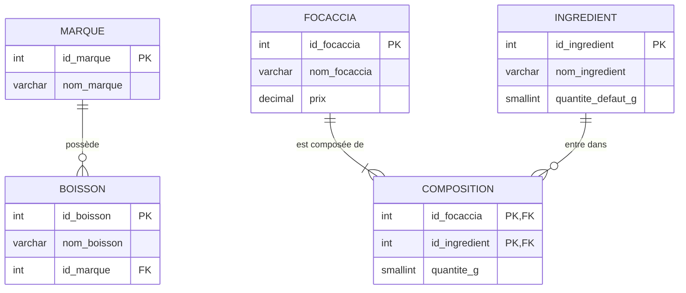

# Modélisation – Base de données « Tifosi »

## 1. Recensement des informations du domaine

Tifosi est un restaurant proposant des **focaccias** et des **boissons**.

- Une **focaccia** possède un nom et un prix de vente. Elle est composée de
  plusieurs **ingrédients**, chacun en une certaine quantité (en grammes).
- Un **ingrédient** possède un nom et une quantité par défaut (le grammage
  standard appliqué « sauf indication contraire »). Le même ingrédient peut
  entrer dans la composition de plusieurs focaccias.
- Une **boisson** possède un nom et appartient à une **marque** commerciale.
- Une **marque** regroupe plusieurs boissons.

## 2. Règles de gestion

1. Une focaccia est composée de 1 à N ingrédients ; un ingrédient peut figurer
   dans 0 à N focaccias → **association N..N** porteuse de la quantité.
2. Une boisson appartient à exactement 1 marque ; une marque possède 0 à N
   boissons → **association 1..N**.
3. Les noms de marque, d'ingrédient et de focaccia sont uniques.
4. Le prix d'une focaccia est strictement positif.

## 3. Modèle Conceptuel de Données (MCD – Merise)

```
MARQUE (id_marque, nom_marque)
        |
        | 1,1  « est de »            0,n
INGREDIENT ----< COMPOSER >---- FOCACCIA
 (1,n)   [quantite_g]   (1,n)

BOISSON (id_boisson, nom_boisson) --(1,1)-- appartient --(0,n)-- MARQUE
```

Diagramme entité-association (rendu Mermaid) :



## 4. Modèle Logique de Données (MLD)

L'association N..N `COMPOSER` est transformée en une table de jonction
`composition` dont la clé primaire est la concaténation des deux clés
étrangères. L'association 1..N place la clé de `marque` comme clé étrangère
dans `boisson`.

```
marque      (id_marque, nom_marque)
boisson     (id_boisson, nom_boisson, #id_marque)
ingredient  (id_ingredient, nom_ingredient, quantite_defaut_g)
focaccia    (id_focaccia, nom_focaccia, prix)
composition (#id_focaccia, #id_ingredient, quantite_g)
```

Légende : clé primaire soulignée par convention, `#` = clé étrangère.

## 5. Choix techniques

| Choix | Justification |
|-------|---------------|
| Moteur **InnoDB** | Support des clés étrangères et des transactions. |
| Jeu **utf8mb4** | Gestion correcte des accents (é, è, œ…). |
| `DECIMAL(5,2)` pour le prix | Évite les erreurs d'arrondi des flottants sur des montants. |
| `SMALLINT UNSIGNED` pour les grammages | Entier positif suffisant (max 65 535 g). |
| Contrainte `UNIQUE` sur les noms | Empêche les doublons fonctionnels. |
| `CHECK (prix > 0)` | Garantit un prix valide au niveau de la base. |
| Quantité portée par `composition` | Le grammage dépend du couple (focaccia, ingrédient), pas de l'ingrédient seul. |
